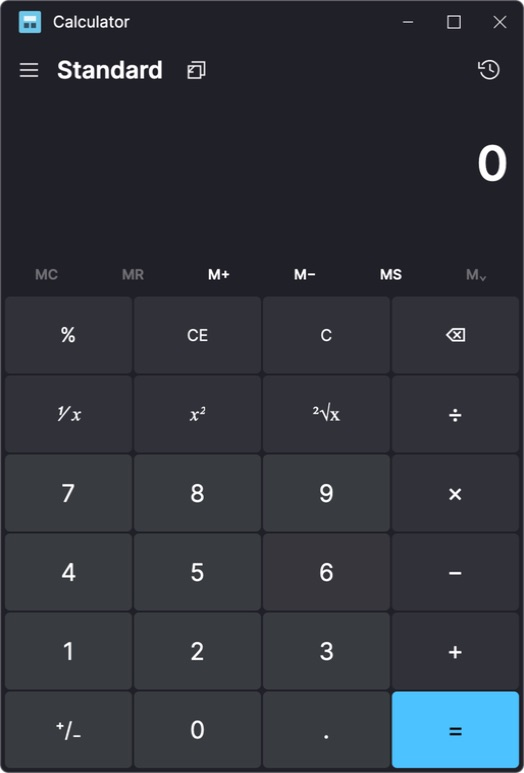

# Avalonia frontend

`Calculator.Avalonia` is the production cross-platform calculator frontend.
`Calculator.AvaloniaBench` is a standalone UI sample used to evaluate controls
and interactions without changing the calculator.

## Source-faithful Avalonia calculator slice

`Calculator.Avalonia` reconstructs the original Standard Calculator UI from
`Calculator.xaml`, `CalculatorStandardOperators.xaml`, and `NumberPad.xaml` in
the pinned Microsoft Calculator submodule. Its standard keypad is connected
through the managed C ABI wrapper to the original CalculatorManager engine
compiled directly from that submodule.



```sh
dotnet run --project Calculator.Avalonia/Calculator.Avalonia.csproj
```

To create a self-contained Apple Silicon build and package it as a macOS app:

```sh
dotnet publish Calculator.Avalonia/Calculator.Avalonia.csproj \
  -c Release -r osx-arm64 --self-contained true
sh Calculator.Avalonia/Packaging/macos/package-macos.sh
```

## Avalonia comparison gallery

```sh
dotnet run --project Calculator.AvaloniaBench/Calculator.AvaloniaBench.csproj
```

The gallery includes light/dark theme switching, action and input controls,
selection and progress controls, a calculator-style keypad, and recent-history
selection. The keypad is deliberately a UI interaction sample rather than a
complete calculator implementation.
